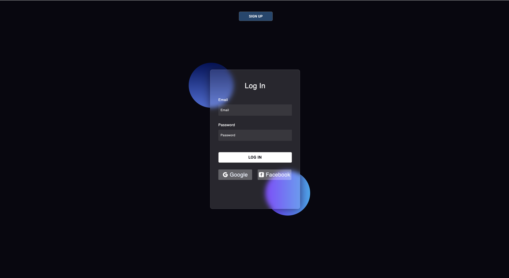
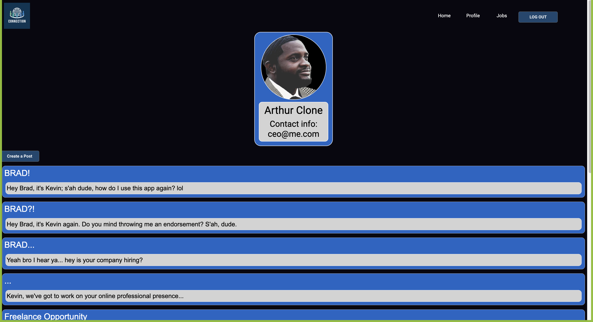
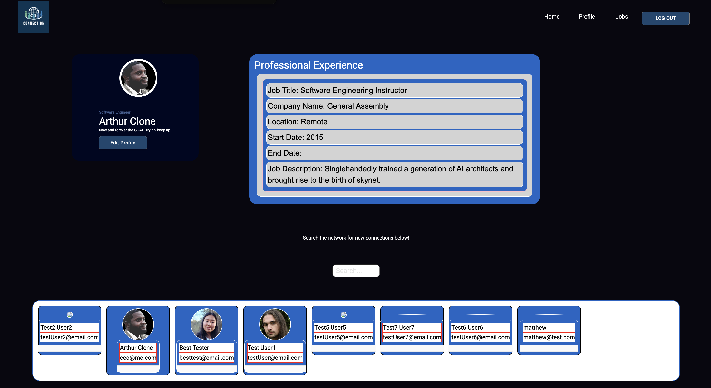
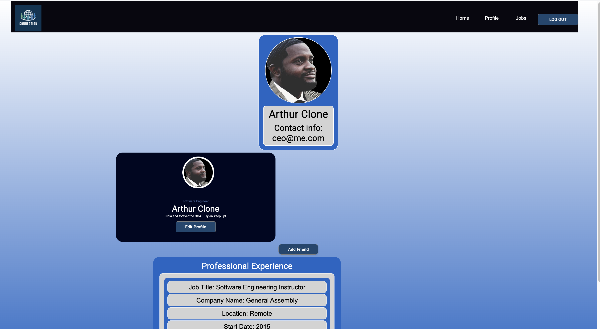
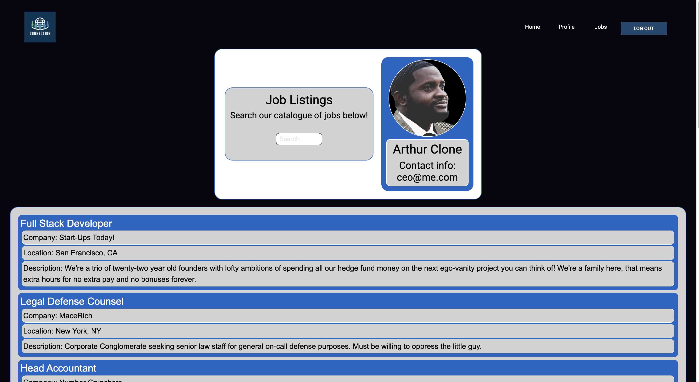

<h1>Connections</h1>
<h2>a Linkedin Alternative</h2>

<h3>Live Deployment Link: </h3>

<a href="https://connections.mattchen.me">Connections - a Linkedin Alternative</a> 
<br>
<div>Purpose of application: "For the people who agree that linkedin just feels kinda gross and a second option would be nice."</div>
<div>Trello Board Link: https://trello.com/b/xOZueoOA linkedinclone-group </div>
<div>ERD Mockups: https://lucid.app/lucidchart/9d300fc8-551c-4d9e-8eaf-b29a1a9ad3f1/edit?page=0_0# </div>
<div>Link to these presentation deck notes: https://docs.google.com/document/d/1--KriUyahZxFxPvrh1RJT739USgFGF91hNr-ooYyFZ0/edit </div>
<h4>Main Concept: </h4>
<div>As a user, I want to be able to make and search job postings on this professional social networking app. I want to be able to manage my account, view other users' profiles, make and view posts, and make a lasting 'connection' with people who I'd like to add to my network. I want to be able to converse with anyone on the app through live chat messaging.</div>

<h3>~Locally cloned instructions~</h3>
<p>After successfully forking and cloning the source repo, navigate via terminal command line to your cloned folder location. When in the cloned folder, create an env file with the following command: </p>

```
npm i
```
<br>

```
touch .env
```

<p>Then to open up your project folder to view code and make necessary edits to the env file, type the following in the command line: </p>

```
code .
```


<p>Navigate to your env file while your project is opened in vs code and populate the env file with the following data, making sure to replace the template phrases in the below tags with your specific data...</p>

```
MONGO_URI=<enterLinkInformationToYourMongDBdatabase>
SECRET=<enterSHA-256-SECRET-encryptionToPreferredSecretPassword>
SEED_PASSWORD=<yourPreferredStarterAccountPasswords>
PORT=<yourPreferredPortNumber>
```

SECRET <strong>must</strong> be a sha256 hash. Link to hashing site <a href="https://emn178.github.io/online-tools/sha256.html">HERE</a>.
<br>Once your .env is correctly created, SAVE FILE<br><br>

<h4>NODE VERSION REQUIREMENTS:</h4>
In order to run this program you must have Node version 20 installed and running on your device.
<br>
<h4>Necessary packages to install<h4>
<br> Type the following verbatim into terminal's command line while in working project folder to install relevant packages:<br>

```
npm i
```

<h4>Almost There!</h4>
<p>You'll want to initiate your seed file before starting the server. Make sure that you've correctly input the requested data in your env file before proceeding, then type the following command in your project folder's terminal command line: </p>

```
npm run seed
```

<h5>Presto! Fully seeded application!</h5>
<p>Don't like the seed file and want to start from scratch? Sure thing! If you've already installed seed file or else populated your local database with unwanted data, clear the pallet and start fresh with the following command: </p>

```
npm run seedDeleter
```


<h4>Server running instructions: </h4>

<p>To run the application on dev server: </p>

```
npm run dev
```

<br>
<div>Explanation of technologies used: MongoDB, Express, Node JS, React, Git/github, Digital Ocean</div?>
<div>Full stack RESTful application featuring full CRUD functionality on a live deployed server.</div>

<div>Future enhancements planned:</div>
<ul>
    <li>Live chat messaging</li>
    <li>Viewing the array of connections made and allowing clickability to user show profile pages therein </li>
    <li>Allowing identity of poster to display on pages. </li>
    <li>Allow additional styling.</li>
</ul>

<h3>Developed by: </h3>
<ul>
    <li>Matthew Chen</li>
    <a href="https://github.com/mchen719">Link to Matthew's Github Profile</a>
    <li>Lilianne Kho</li>
    <a href="https://github.com/liliannekho">Link to Lilianne's Github Profile</a>
        <li>Christopher Devalme</li>
    <a href="https://github.com/NeverGiveUpForLife32">Link to Christopher's Github Profile</a>
        <li>Christopher Lazariuk</li>
    <a href="https://github.com/Clazariuk1">Link to Christopher's Github Profile</a>
        <li>Christopher Fleming</li>
    <a href="https://github.com/NeverGiveUpForLife32">Link to Christopher's Github Profile</a>
        <li>Alioune Seck</li>
    <a href="https://github.com/JellyGodKyrie">Link to Alioune's Github Profile</a>
</ul>


<h1>Screenshots</h1>
<h2>Login Screen</h2>

<br/>
<h2>Home Page</h2>

<br/>
<h2>Profile Page</h2>

<br/>
<h2>Show User Page</h2>

<br/>
<h2>Jobs Page</h2>

